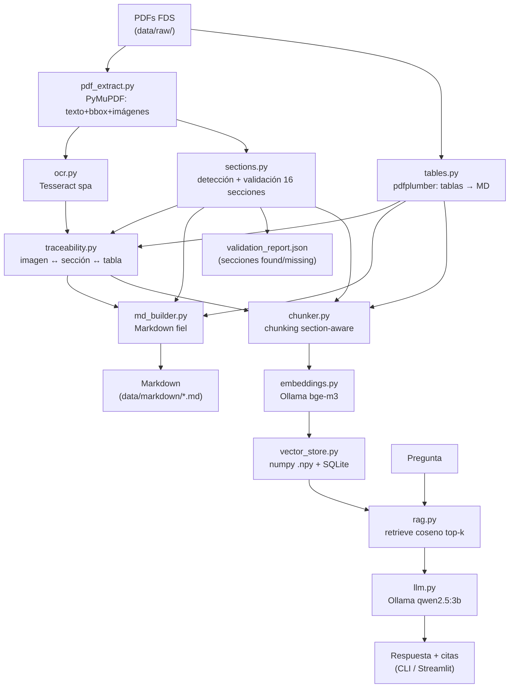

# Arquitectura del sistema

Sistema RAG **100% local** para Fichas de Datos de Seguridad (FDS) de SIKA. La
arquitectura prioriza tres ejes que pesan en la evaluación: **fidelidad estructural**
del Markdown, **baja dependencia / reproducibilidad**, y **bajo costo computacional**
(corre en una GTX 1650 de 4 GB con ~15 GB de RAM).

## Diagrama general

## Componentes

| Capa | Módulo | Tecnología | Responsabilidad |
|------|--------|-----------|-----------------|
| Extracción | `pdf_extract.py` | PyMuPDF | Texto con bbox y formato, imágenes, detección de escaneo |
| Extracción | `tables.py` | pdfplumber | Tablas → Markdown (estrategia líneas/texto) |
| Extracción | `ocr.py` | Tesseract (`spa`) | OCR de imágenes y páginas escaneadas |
| Estructura | `sections.py` | regex + heurística | Detección y validación de las 16 secciones |
| Estructura | `traceability.py` | geometría + regex | Asociación imagen ↔ sección ↔ tabla |
| Estructura | `md_builder.py` | — | Ensamblaje del `.md` fiel (UTF-8 NFC) |
| Índice | `chunker.py` | — | Chunking section-aware con metadata |
| Índice | `embeddings.py` | Ollama HTTP | Embeddings multilingües L2-normalizados |
| Índice | `vector_store.py` | numpy + SQLite | Almacenamiento y búsqueda coseno |
| RAG | `rag.py` + `llm.py` | Ollama HTTP | Recuperación + generación con citas |
| Interfaz | `query_cli.py`, `app_streamlit.py` | Streamlit | Demo y consulta |
| Evaluación | `src/eval/` | — | Ground truth + métricas |

## Decisiones de arquitectura y justificación

1. **Extracción híbrida liviana (PyMuPDF + pdfplumber + Tesseract)** en lugar de
   parsers basados en deep learning (Docling, Marker). Razón: la FDS digital tiene
   texto nativo y encabezados regulares; un parser estadístico ligero es más rápido,
   reproducible y sin descargas de modelos pesados. Cabe en la RAM disponible.

2. **Embeddings y LLM vía Ollama por HTTP (sin `torch`).** Se consumen con `requests`.
   Esto elimina la dependencia más pesada del ecosistema (PyTorch + CUDA) y mantiene
   todo local. Modelos: `bge-m3` (embeddings multilingües, 1024-dim) y
   `qwen2.5:3b-instruct` (buen español), ambos en Q4 para caber en 4 GB de VRAM.

3. **Vector store propio (numpy `.npy` + SQLite)** en vez de ChromaDB/FAISS. Para un
   corpus de cientos de chunks, la similitud coseno por producto punto sobre una
   matriz normalizada es sub-milisegundo y no añade ~6-8 dependencias transitivas.
   La metadata en SQLite (stdlib) habilita filtrado por sección y trazabilidad. Está
   encapsulado tras la clase `VectorStore`, así que cambiar de backend es trivial.

4. **Indexación y consulta en fases separadas.** El recurso más escaso es la RAM
   (~3 GB libres). `build_index.py` genera **todos** los embeddings con el embedder
   como único modelo cargado y persiste el índice; el LLM solo se carga después, en
   consulta. Con `keep_alive=0` cada modelo se descarga tras su llamada, evitando que
   embedder y LLM coexistan en memoria.

5. **Trazabilidad de extremo a extremo.** Cada chunk guarda
   `{source_pdf, section_number, section_title, page, has_table, image_refs}`; la
   respuesta cita `[fuente: <pdf>, Sección N, p.X]`; y cada imagen del `.md` lleva su
   "Nota de trazabilidad". Así toda afirmación es rastreable hasta su fragmento fuente.

## Relación desempeño / costo / complejidad

- **Costo:** sin GPU obligatoria (degrada a CPU), sin servicios externos, ~3 GB de
  modelos descargados una sola vez.
- **Desempeño:** recuperación instantánea; latencia dominada por la generación del LLM
  pequeño (segundos en CPU, sub-segundo en GPU).
- **Complejidad operativa:** un único `setup.sh`, un comando para indexar y otro para
  consultar; sin orquestadores ni bases de datos que administrar.
